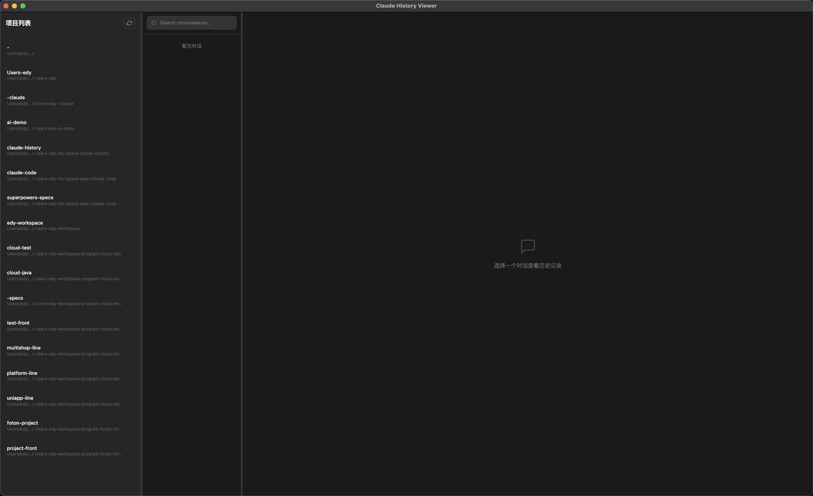
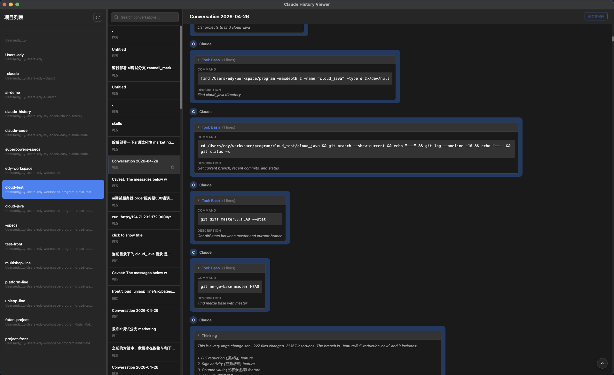
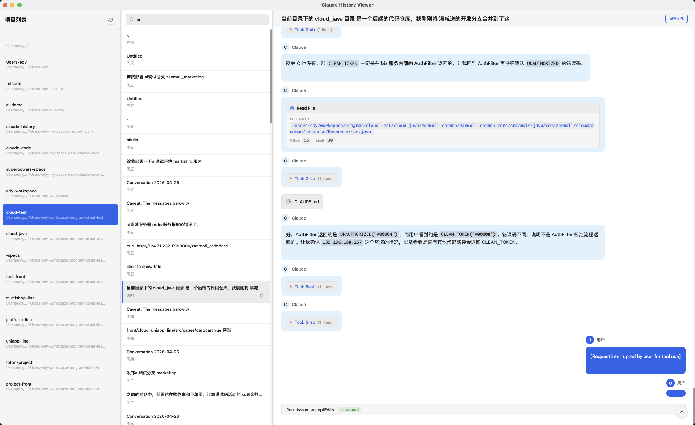
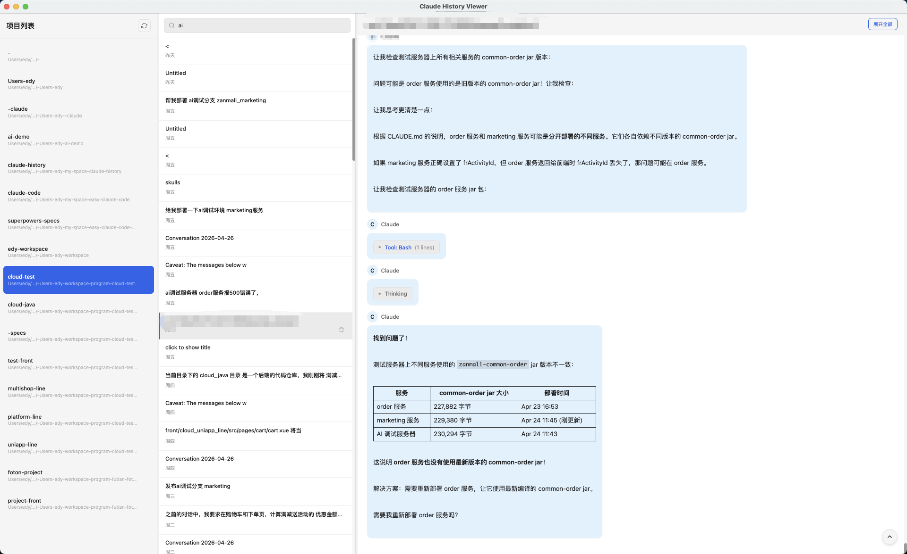

# Claude History Viewer

一款用于浏览本地 Claude Code 对话历史的桌面应用。

## 功能特性

- **三栏布局**：项目列表 → 对话列表 → 消息详情
- **优雅的对话展示**：支持 Markdown 渲染、代码高亮、工具调用展示
- **特殊工具优化**：
  - TaskCreate：任务创建卡片式展示
  - Edit/Write：文件修改对比展示
  - Read：文件读取路径清晰展示
  - Bash：命令与描述分开展示
- **智能标题清理**：自动移除命令标签噪音
- **中文界面**：完整的本地化支持
- **删除确认**：数据安全保护

## 技术栈

- **前端框架**：Vue 3 + Vite
- **状态管理**：Pinia
- **桌面应用**：Electron
- **数据库**：SQLite (better-sqlite3)
- **Markdown**：marked
- **样式**：CSS Variables

## 安装运行

```bash
# 安装依赖
pnpm install

# 开发模式
pnpm dev

# 构建应用
pnpm build
```

## 项目结构

```
claude-history/
├── electron/           # Electron 主进程
│   ├── ipc-handlers.js    # IPC 处理器
│   ├── message-parser.js  # 对话解析器
│   └── file-scanner.js    # 项目扫描器
├── src/               # Vue 渲染进程
│   ├── components/    # Vue 组件
│   │   ├── ChatBubble.vue       # 聊天气泡
│   │   ├── ConversationList.vue  # 对话列表
│   │   ├── MessageThread.vue    # 消息线程
│   │   ├── ProjectList.vue      # 项目列表
│   │   ├── ToolCall.vue          # 工具调用
│   │   └── *ToolBlock.vue        # 各类工具展示组件
│   ├── stores/        # Pinia 状态管理
│   └── utils/         # 工具函数
└── docs/              # 设计文档
```

## 数据来源

应用读取 `~/.claude/projects/` 目录下的对话记录文件（`.jsonl` 格式）。

## 截图预览

### 主界面 - 三栏布局


### 对话详情 - 工具调用展示


### 任务卡片 - TaskCreate 优化


### 命令展示 - CommandBlock 优化


## License

MIT