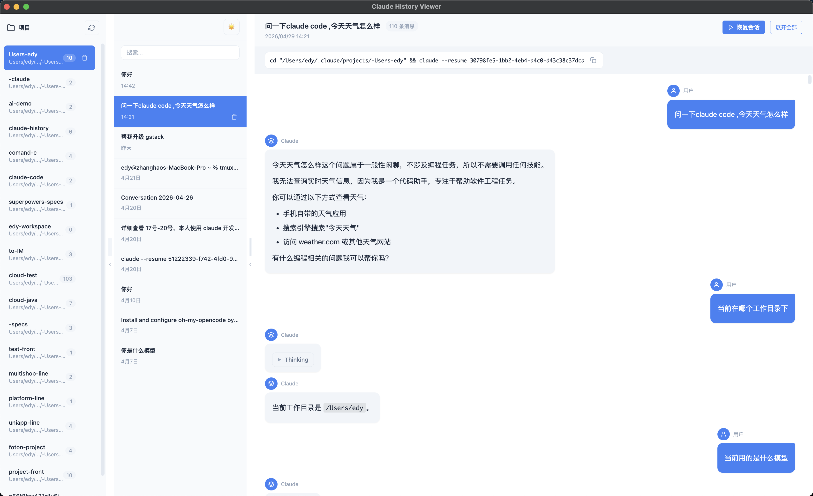
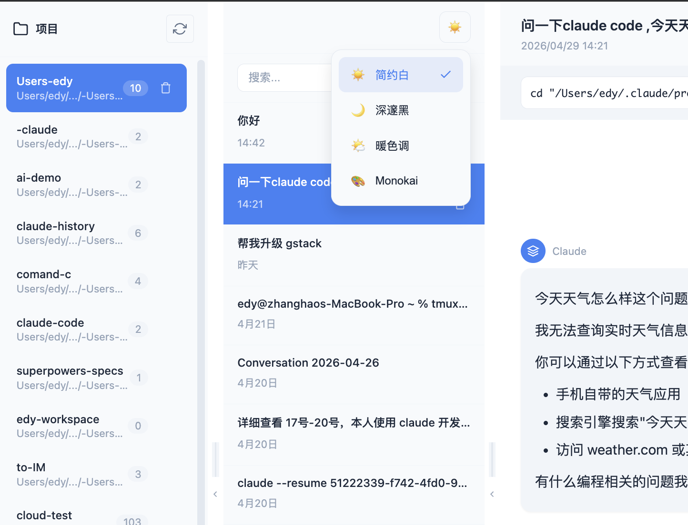
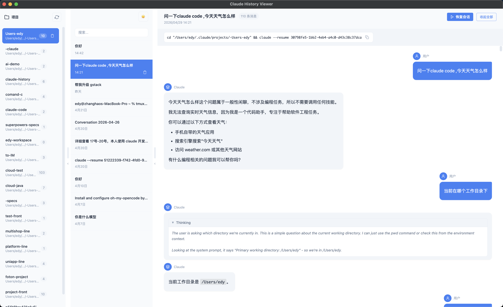
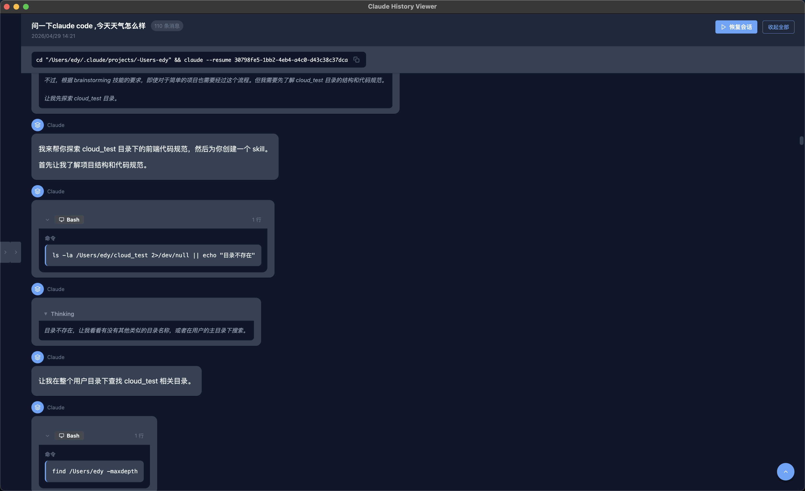
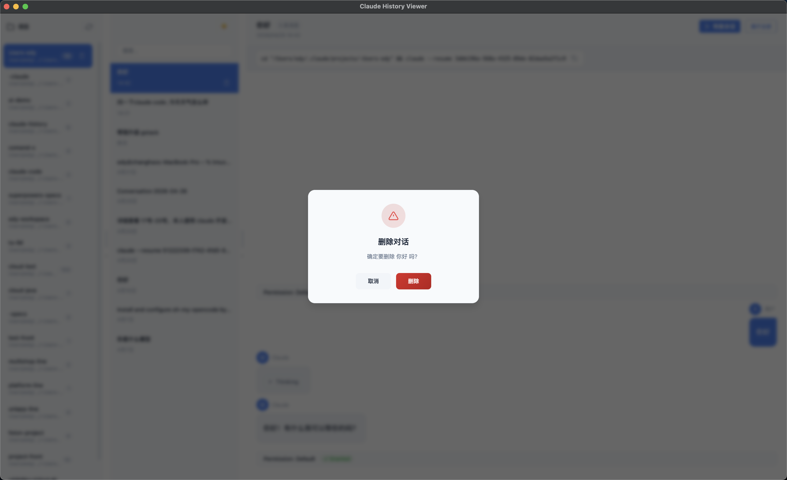
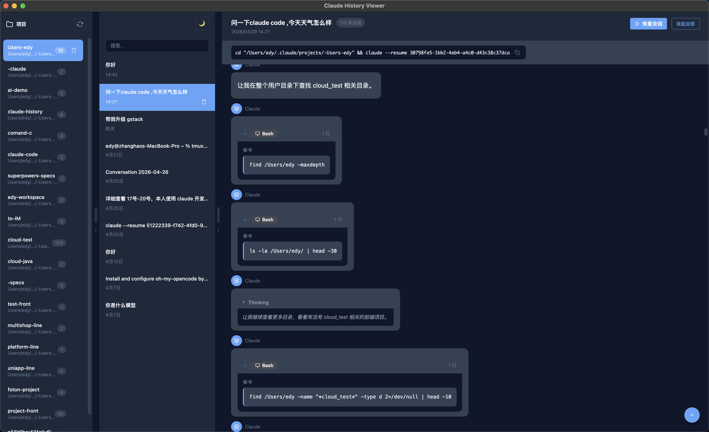

# Claude History Viewer

一款用于浏览和管理本地 Claude Code 对话历史的桌面应用。

## 功能特性

- **三栏可折叠布局**：项目列表 → 对话列表 → 消息详情，左右面板支持一键收起/展开
- **优雅的对话展示**：支持 Markdown 渲染、代码高亮、表格样式、图片点击放大预览
- **主题切换**：支持简约白 / 深邃黑 / 暖色调 / Monokai 四种主题
- **会话恢复**：一键在终端中恢复历史会话，继续之前的对话
- **专用工具展示组件**：Agent 子代理、AskUserQuestion 交互问题、TodoWrite 任务清单、Edit/Write 文件 diff 对比、Read 文件路径、Bash 命令、Thinking 思维过程等
- **智能标题提取**：自动从对话内容中提取并生成标题
- **中文界面**：完整的本地化支持
- **安全删除**：支持删除对话和项目（同时移除磁盘文件和数据库记录）

## 截图预览

<p align="center">
  
</p>
<p align="center">完整使用</p>

<p align="center">
  
</p>
<p align="center">三栏布局 - 项目列表 / 对话列表 / 消息详情</p>

<p align="center">
  
</p>
<p align="center">深色主题</p>

<p align="center">
  
</p>
<p align="center">对话详情 - Markdown 渲染与工具展示</p>

<p align="center">
  
</p>
<p align="center">命令与工具调用展示</p>

<p align="center">
  
</p>
<p align="center">删除确认弹窗</p>

<p align="center">
  
</p>
<p align="center">四种主题切换</p>

## 快速开始

### 安装依赖

```bash
# 推荐 pnpm（也可使用 npm 或 cnpm）
pnpm install

# 如果 Electron 下载慢，使用镜像
export ELECTRON_MIRROR=https://npmmirror.com/mirrors/electron/
pnpm install
```

### 开发模式

```bash
pnpm electron:dev
```

### 构建应用

```bash
pnpm electron:build
```

构建完成后，应用会生成在 `out` 目录下。

## 技术栈

| 层级 | 技术 |
|------|------|
| 前端框架 | Vue 3 + Vite |
| 状态管理 | Pinia |
| 桌面应用 | Electron |
| 数据库 | SQLite (better-sqlite3) |
| Markdown | marked + DOMPurify |
| 代码高亮 | highlight.js |

## 项目结构

```
claude-history/
├── electron/                  # Electron 主进程
│   ├── index.js                 # 主进程入口，创建窗口
│   ├── preload.js               # 预加载脚本，暴露 IPC 接口
│   ├── ipc-handlers.js          # IPC 通信处理器
│   ├── file-scanner.js          # 扫描 ~/.claude/projects 目录
│   ├── jsonl-parser.js          # 流式 JSONL 解析器
│   ├── message-parser.js        # 消息解析与结构化
│   ├── store.js                 # SQLite 数据库操作
│   ├── markdown.js              # Markdown 渲染（主进程端）
│   └── title-extractor.js       # 标题提取工具
├── src/                       # Vue 渲染进程
│   ├── App.vue                  # 根组件，三栏布局
│   ├── main.js                  # 渲染进程入口
│   ├── components/
│   │   ├── layout/              # 页面级布局组件
│   │   │   ├── ProjectList.vue        # 左栏 - 项目列表
│   │   │   ├── ConversationList.vue   # 中栏 - 对话列表
│   │   │   └── MessageThread.vue      # 右栏 - 消息详情
│   │   ├── chat/                # 消息内容渲染
│   │   │   ├── ChatBubble.vue         # 聊天气泡容器
│   │   │   ├── ThinkingBlock.vue      # 思维过程折叠
│   │   │   ├── CommandBlock.vue       # 命令内容块
│   │   │   ├── PermissionBadge.vue    # 权限模式徽章
│   │   │   └── FileSnapshot.vue       # 文件快照
│   │   ├── tools/               # Claude 工具调用组件
│   │   │   ├── ToolCall.vue           # 通用工具调用
│   │   │   ├── ToolResult.vue         # 工具执行结果
│   │   │   ├── AgentToolBlock.vue     # Agent 子代理
│   │   │   ├── EditToolBlock.vue      # 文件编辑 diff
│   │   │   ├── ReadToolBlock.vue      # 文件读取
│   │   │   ├── WriteToolBlock.vue     # 文件写入
│   │   │   ├── TaskCreateBlock.vue    # 任务创建
│   │   │   ├── TaskUpdateBlock.vue    # 任务更新
│   │   │   ├── TaskOutputBlock.vue    # 任务输出
│   │   │   ├── TodoWriteBlock.vue     # 任务清单
│   │   │   └── AskUserQuestionBlock.vue # 交互问题
│   │   └── common/              # 通用 UI 组件
│   │       ├── SearchBar.vue          # 搜索输入框
│   │       ├── SkeletonLoader.vue     # 骨架屏加载
│   │       ├── ConfirmDialog.vue      # 确认弹窗
│   │       └── ThemeSelector.vue      # 主题选择器
│   ├── stores/                  # Pinia 状态管理
│   │   ├── projects.js             # 项目数据
│   │   ├── conversations.js        # 对话数据与缓存
│   │   └── theme.js                # 主题状态
│   ├── styles/                  # 全局样式
│   │   ├── variables.css           # CSS 变量定义
│   │   └── global.css              # 全局基础样式
│   └── utils/                   # 工具函数
│       ├── markdown.js             # Markdown 渲染
│       └── title-extractor.js      # 标题提取与清理
├── preview/                   # 应用截图
└── build/                     # 应用图标
```

## 数据来源

应用读取 `~/.claude/projects/` 目录下的 Claude Code 对话记录文件（`.jsonl` 格式）。

数据流：`磁盘文件` → `file-scanner 扫描` → `SQLite 缓存` → `Pinia Store` → `Vue 组件渲染`

## 使用技巧

| 功能 | 操作 |
|------|------|
| 面板折叠/展开 | 点击面板分隔线旁的箭头按钮 |
| 调整面板宽度 | 拖拽面板之间的分隔线 |
| 搜索对话 | 在对话列表顶部搜索框输入关键词 |
| 恢复会话 | 点击「恢复会话」按钮，自动打开终端执行 `claude --resume` |
| 复制恢复命令 | 点击命令区域一键复制 |
| 展开/折叠全部 | 使用消息详情标题栏的「展开全部」/「收起全部」按钮 |
| 图片预览 | 点击图片全屏放大，点击遮罩或按 Escape 关闭 |
| 开发者工具 | `Ctrl+K` (Windows) / `Cmd+K` (Mac) |

## 常见问题

### Electron 下载失败

```bash
export ELECTRON_MIRROR=https://npmmirror.com/mirrors/electron/
pnpm install
```

### macOS 上提示"无法打开"

首次运行需要在「系统偏好设置 → 安全性与隐私」中允许应用运行。

### 构建失败

确保已安装 Xcode Command Line Tools：

```bash
xcode-select --install
```

## License

MIT
